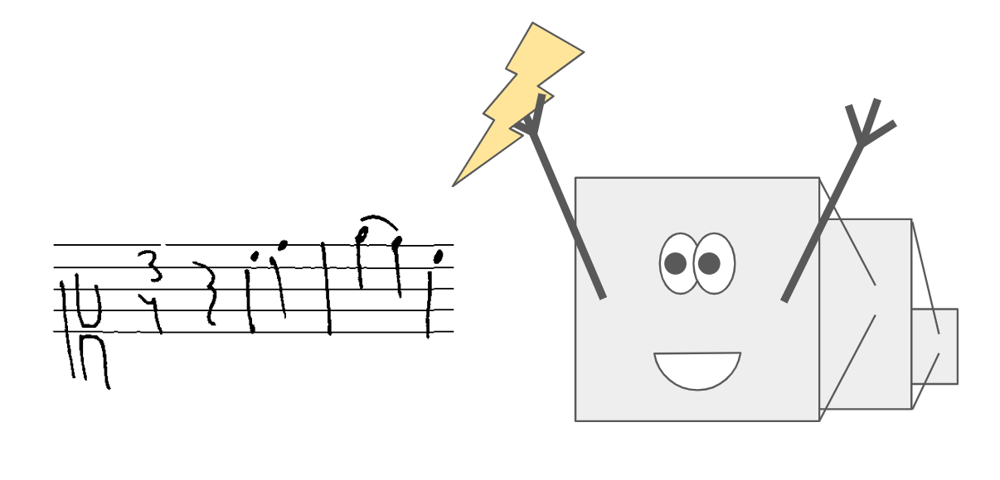

# Zeus

<div align="center">
    <br/>
    
    <br/>
    <br/>
</div>

Zeus is a deep learning model for reading staves and grandstaves of music notation. This repository is structured as a python package that lets you train Zeus, save and load it from checkpoints and use it for inference.


## CLI

The package exposes the `zeus` CLI command, which should be used to work with the model:

- `zeus` **`musicorpus`** `--help`: Converts a [MusiCorpus](https://github.com/OmniOMR/musicorpus) dataset to Zeus dataset.
- `zeus` **`pickle`** `--help`: Bundles one Zeus dataset split into a pickle file for faster loading on the compute cluster.
- `zeus` **`train`** `--help`: Trains a Zeus model, both new or loaded.
- `zeus` **`evaluate`** `--help`: Performs symbol error rate evaluation on LMX against the given dataset split.
- `zeus` **`predict`** `--help`: TODO


## Documentation

- Zeus dataset format and pickling
- Converting MusiCorpus datasets to Zeus format
- Model architecture
- Model snapshots
- Training Zeus
- Training on the UFAL LRC cluster
- ...
- TODO: LMX and MusicXML
- TODO: Prediction, streaming
- TODO: Python API


## Existing snapshots

... TODO ...
- zeus olimpic / grandstaff from 2024
- other snapshots published where ...
- where experiments are recorded ...


## Usage

You have two ways how to use Zeus for your project:

1. Use just the CLI - install Python 3.10, setup a venv and install this package into it
2. Use the Python API - your project already runs Python 3.10, simply install this package

In other words, if you can't afford to have your project on Python 3.10, you must use Zeus via its CLI. Otherwise you can also use its Python API.

This is the command to install Zeus from this github repository at the latest commit:

```bash
pip install zeus @ git+https://github.com/OmniOMR/zeus.git@main
```

Learn more about [VCS support](https://pip.pypa.io/en/stable/topics/vcs-support/) of `pip`.


## Development

Clone this repo, create a venv, install the package into it and activate the venv to get the `zeus` CLI command.

This code requires `Python 3.10.7`, because the old version of TensorFlow needs it.

```bash
# clone
git clone git@github.com:OmniOMR/zeus.git
cd zeus

# make venv
python3.10 -m venv .venv

# install itself
.venv/bin/pip3 install -e .

# activate venv
source .venv/bin/activate

# now you can run CLI commands with the local code
zeus --help
```


## How to cite

The model is derived from its original design from 2024. If you use this repository, please cite the following paper:

Jiří Mayer, Milan Straka, Jan Hajič jr., Pavel Pecina. Practical End-to-End Optical Music Recognition for Pianoform Music. *18th International Conference on Document Analysis and Recognition, ICDAR 2024.* Athens, Greece, August 30 - September 4, pp. 55-73, 2024.<br/>
**DOI:** https://doi.org/10.1007/978-3-031-70552-6_4<br/>
**GitHub:** https://github.com/ufal/olimpic-icdar24
