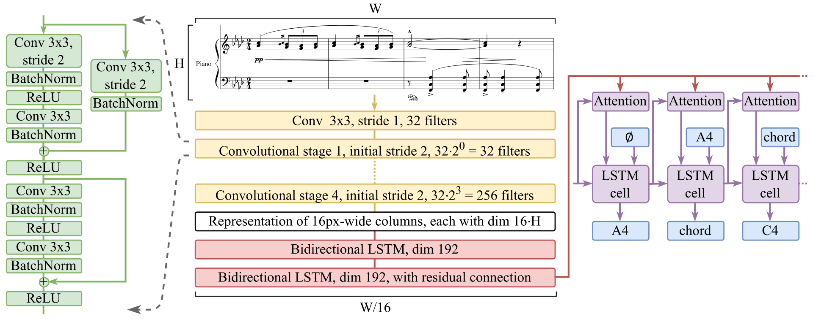

# Model architecture

The Zeus model architecture is an encoder-decoder architecture.

The input image has a fixed height `H` and variable width `W`. The encoder uses convolutional layers (yellow) to reduce the spatial resolution of the image and extract features, and then bi-directional LSTM layers (red) contextualize the extracted representation. The encoder produces a sequence of 1D feature vectors, where the length of the sequence depends on the width `W` of the input image (it is reduced 16 times).

The decoder auto-regressively produces the final output (sequence of LMX tokens), while looking at the whole decoder output through Bahdanau attention.



The specific values (dimensions, features, layer counts) may be modified and they are specified by the `ArchitectureOptions` class. The ones in the diagram above correspond to the `grand24` architecture - the settings used to train the Zeus grand-staff model from 2024.

There are a few pre-defined architecture options you can choose from:

- `grand24` grand-staff architecture used in the [ICDAR 2024 paper](https://doi.org/10.1007/978-3-031-70552-6_4), input image height is 192 pixels
- `solo26` solo-staff architecture introduced in 2026, has reduced image height to 128 pixels

When training a new model, the architecture to be used must be specified as part of the command:

```bash
zeus train ... --architecture solo26 ...
```
